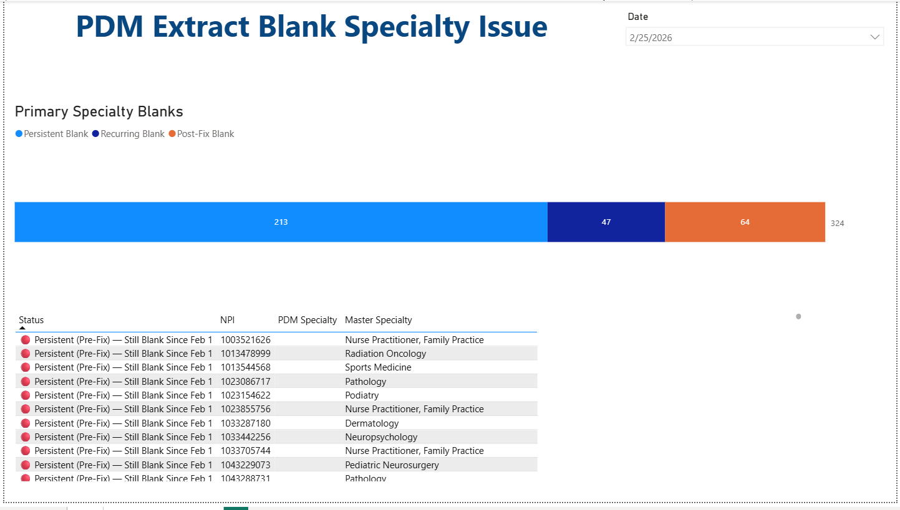

# Healthcare Data Analytics Portfolio
Miguel Hernandez Aldana

## About Me
Healthcare data analyst with 8+ years of experience in provider network operations, data migration validation, and ETL automation. Specialized in Power Query, Power BI, and healthcare data quality frameworks.

## Technical Skills
- **Data Analysis:** SQL, Power Query (advanced), Power BI, Excel
- **Data Quality:** Multi-system reconciliation, validation frameworks, root cause analysis
- **Healthcare Domain:** Provider data management, EDI (ANSI X12), DMHC/CMS compliance
- **Tools:** Power BI Service, SFTP automation, HealthEdge PDM, HealthRules Payor

### 1. 📊 Power BI Migration Validation Dashboards

**Purpose:** Track data migration validation progress for 12,000+ provider records

#### Executive Dashboard: Specialty Verification

**Key Features:**
- Real-time compliance tracking (96.5% current rate)
- Trend analysis showing improvement from 95% → 96.5% over 6 weeks
- KPI cards for at-a-glance status
- Date filtering for time-based analysis

#### Technical Dashboard: Blank Specialty Issue Tracking

**Key Features:**
- Issue categorization (Persistent: 64, Recurring: 88, Post-Fix: 4)
- Color-coded status indicators for quick triage
- Detailed NPI-level tracking
- Root cause analysis support

**Business Impact:**
- Enabled executive decision-making on production cutover readiness
- Identified 152 specialty validation issues requiring remediation
- Tracked progress toward 95% accuracy threshold

## Contact
- Email: miguelheral89@gmail.com
- LinkedIn: [linkedin.com/in/miguel-hernandez-aldana-883a88253](https://linkedin.com/in/miguel-hernandez-aldana-883a88253)
