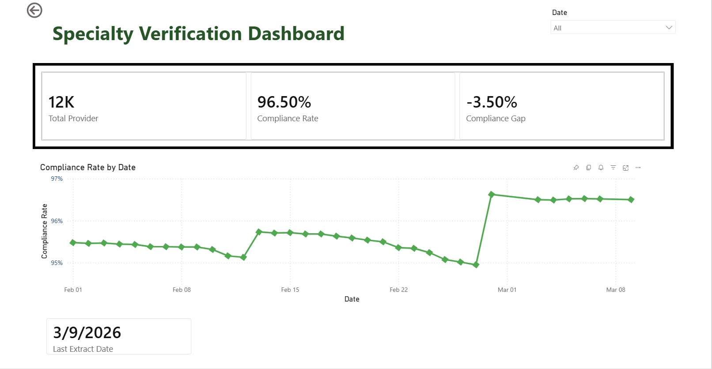
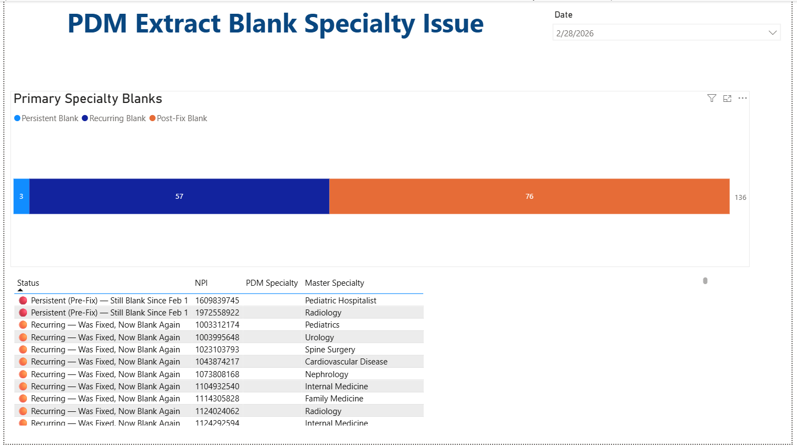

# Healthcare Data Analytics Portfolio
Miguel Hernandez Aldana
Healthcare Data Analyst | Provider Network Operations | Data Migration & Quality

## Power BI Migration Validation Dashboards

**Purpose:** Track Sutter Health Plan data migration validation progress for 12,000+ provider records across dual-system reconciliation

#### Executive Dashboard: Specialty Verification

**Key Features:**
- Real-time compliance tracking (96.5% current rate)
- Trend analysis showing improvement from 95% → 96.5% over 6 weeks
- KPI cards for at-a-glance status
- Date filtering for time-based analysis

#### Technical Dashboard: Blank Specialty Issue Tracking

**Key Features:**
- Issue categorization 
- Color-coded status indicators for quick triage
- Date filtering for time-based analysis
- Detailed NPI-level tracking
- Root cause analysis support

**Business Impact:**
- Enabled executive decision-making on production cutover readiness
- Identified 152 specialty validation issues requiring remediation
- Tracked progress toward 100% accuracy threshold

**Overview of Fidings:**
Provider Data Team identified data quality issues with provider specialty data. The data mantain in the new Provider Data Management User Interface (PDM-U) requires to meet 100 percent threshold for production cut-over. 
The Executive Dashboard provides a real-time compliance tracking. From February 1, 2026 to March 9, 2026, the Compliance Rate has increase from 95.5 percent to 96.5 percent. 
The Team sets remedation strategies by identifiying defects in PDM-UI, and validates buisiness logic with HealthEdge. 
The Technical Dashboard provides real-time root cause anlysis support and specifically idenfiy provider records with data quality issues. 
 

**Technologies:** Power BI, Power Query, DAX, SFTP integration

## Contact
- Email: miguelheral89@gmail.com
- LinkedIn: [linkedin.com/in/miguel-hernandez-aldana-883a88253](https://linkedin.com/in/miguel-hernandez-aldana-883a88253)
