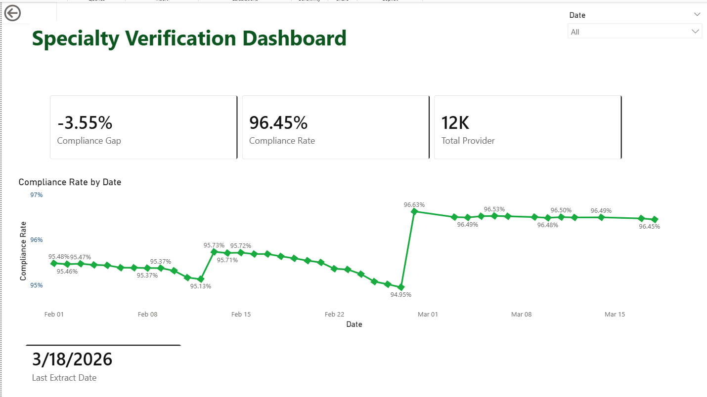
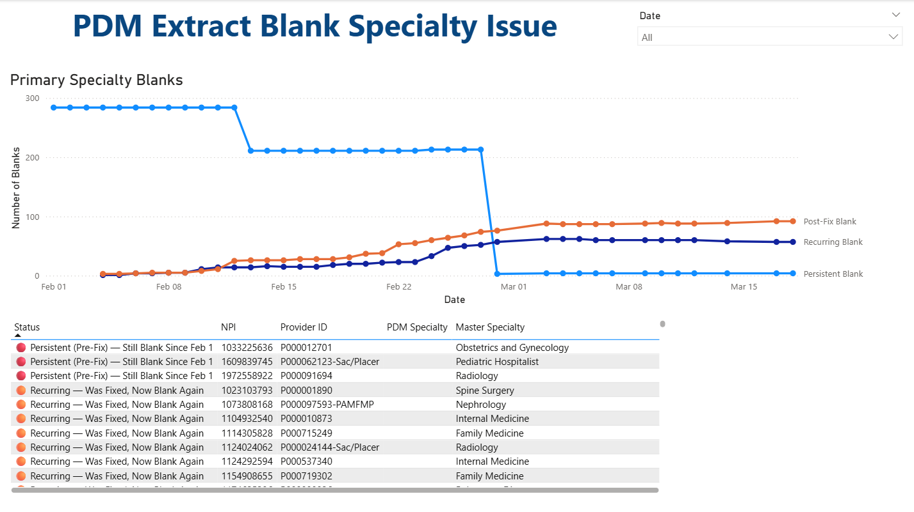

# Healthcare Data Analytics Portfolio
Miguel Hernandez Aldana

Healthcare Data Analyst | Provider Network Operations | Data Migration & Quality

## Power BI Migration Validation Dashboards

**Purpose:** Track Sutter Health Plan data migration validation progress for 12,000+ provider records across dual-system reconciliation post go-live date April 30, 2025. Special considaration to validate provider specialty data was uploaded from legacy Excel file and HealthRules Payer (HRP). Provider data was initially ingested from HRP to new Provider Data Management system (PDM). After, the Master Provider file was ingested. The different sources caused discrepancies in the provider data in PDM. Validation was needed to identify the root causes and implement remediation. This dashboard was created to track remediation progress in real-time.

#### Executive Dashboard: Specialty Verification

**Key Features:**
- Real-time compliance tracking (96.5% current rate)
- Trend analysis showing improvement from 95% → 96.5% over 6 weeks
- KPI cards for at-a-glance status
- Date filtering for time-based analysis

#### Technical Dashboard: Blank Specialty Issue Tracking

**Key Features:**
- Issue categorization
- Real-time remediation tracking
- Color-coded status indicators for quick triage
- Date filtering for time-based analysis
- Detailed NPI-level tracking
- Root cause analysis support

**Business Impact:**
- Enabled executive decision-making on production cutover readiness
- Identified 152 specialty validation issues requiring remediation
- Tracked progress toward 100% accuracy threshold

**Overview of Fidings:**
Provider data in PDM needs to meet 100 treshold before system crossover. Dashboards show migration status needs further review. Identifying blank primary specialties in provider records remediated compliance issues. Compliance rates increase from 94.95% in Frebruary 29, 2026 to 96.6% in March 1, 2026. However, persistent issues with primary specialty data were attributed to issues with the UI. The issue was reported to the vendor. 

**Technologies:** Power BI, Power Query, DAX, SFTP integration

## Contact
- Email: miguelheral89@gmail.com
- LinkedIn: [linkedin.com/in/miguel-hernandez-aldana-883a88253](https://linkedin.com/in/miguel-hernandez-aldana-883a88253)
